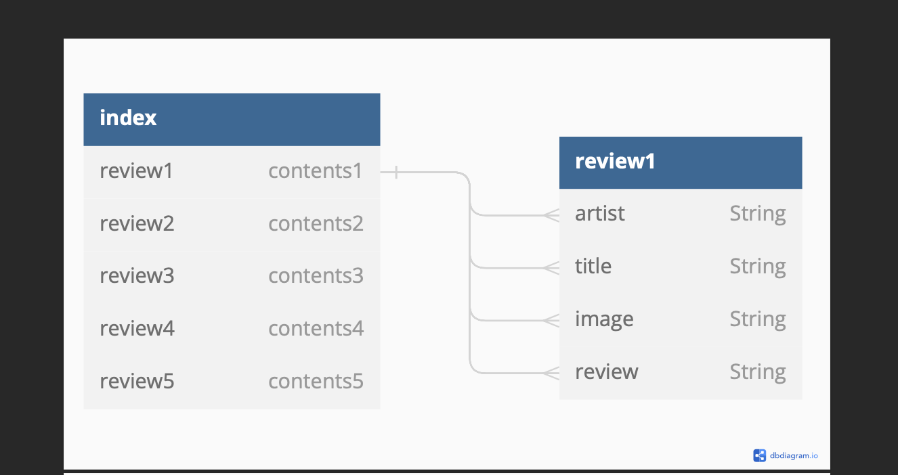

# On the Record - Project 4 Backend
- Project By: Nicholas Smith
- [Github](https://github.com/nicholasjamessmith/ontherecord-backend)
- [Frontend README](https://github.com/nicholasjamessmith/ontherecord-frontend/blob/main/README.md)
- [Deployed Site](https://ontherecord-backend.onrender.com/)
- [Trello Board](https://trello.com/b/BON8XkBD/project4)
- Technologies used:
  - Python
  - Django
  - Django REST framework
  - Postman
  - Render

## Description
The backend server and API is built using the Django web framework, and specifically the Django REST framework. The backend code is written in Python.

The data for this project is stored using a PostgreSQL database via Neon.

The data model for each type of post on the site is a 'review', where each review includes 'artist', 'title', 'image', and 'review', each of which are string values.

The site is designed with RESTful routes architecture, giving functionality to the user experience on the frontend.

## List of Backend Endpoints

| Endpoint          | Method | Purpose                                                          |
| ----------------- | ------ | ---------------------------------------------------------------- |
| /reviews/          | GET    | displays all reviews
| /reviews/create/   | POST   | displays form for new review      |
| /reviews/:id/      | GET    | displays individual show page of a review                       |
| /reviews/delete/:id/| DELETE | deletes current review                                             |
| /reviews/update/:id/ | PUT    | displays form for editing review |

## ERD Diagram
